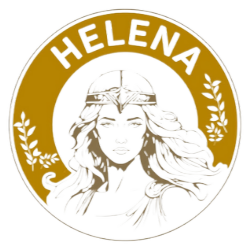

# Helena Library Cafe Automation System

**Helena**, kütüphane ve kafe deneyimini dijitalleştiren, kullanıcıların çalışma alanlarını rezerve etmelerini ve sipariş vermelerini sağlayan kapsamlı bir web tabanlı otomasyon sistemidir.

## 🚀 Proje Hakkında

Bu proje, modern çalışma alanları ve kafeler için geliştirilmiş full-stack bir web uygulamasıdır. Müşteriler için interaktif bir rezervasyon deneyimi sunarken, işletme sahipleri için detaylı bir yönetim paneli sağlar.

## 🌟 Öne Çıkan Özellikler

### 🖱️ İnteraktif Rezervasyon Sistemi
*   **Görsel Yerleşim Planı:** Kullanıcılar, kütüphane/kafe krokisi üzerinden masaları ve sandalyeleri görsel olarak inceleyebilir.
*   **Anlık Doluluk Takibi:** Dolu ve boş koltuklar dinamik olarak görüntülenir.
*   **Alan Seçimi:** "Sesli" ve "Sessiz" çalışma alanları arasında tercih yapma imkanı.

### 🛍️ Dijital Menü ve Sipariş
*   Kategorize edilmiş geniş ürün yelpazesi.
*   Kullanıcı dostu arayüz ile hızlı sipariş oluşturma.
*   Geçmiş siparişlerin takibi.

### 🛡️ Rol Tabanlı Yönetim (RBAC)
*   **Müşteri Paneli:** Profil yönetimi, rezervasyon yapma, sipariş verme.
*   **Admin Paneli:** 
    *   Tüm siparişlerin anlık takibi ve onayı.
    *   Kitap envanter yönetimi ve kiralama takibi.
    *   Rezervasyon yönetimi ve masa düzeni kontrolü.

### 📚 Kütüphane Modülü
*   Mevcut kitapların listelenmesi ve stok takibi.
*   Ödünç alma ve iade süreçlerinin yönetimi.

## 🛠️ Teknik Altyapı

Proje, güvenli ve ölçeklenebilir bir mimari üzerine inşa edilmiştir:

*   **Backend:** PHP (Native), Restful API mimarisi (GET/POST istekleri ile veri yönetimi).
*   **Veritabanı:** MySQL (İlişkisel veritabanı tasarımı, Trigger ve Event Scheduler kullanımı).
*   **Frontend:** HTML5, CSS3 (Responsive Grid/Flexbox yapısı), JavaScript (ES6+, Fetch API).
*   **Güvenlik:** SQL Injection koruması, Session yönetimi, güvenli parola saklama (Password Hashing).

## 📂 Veritabanı Yapısı

Sistem aşağıdaki ana tablolardan oluşur:
*   `users`: Kullanıcı yetkilendirme ve profil verileri.
*   `reservations`: Masa/Sandalye bazlı zaman ayarlı rezervasyon kayıtları.
*   `orders`: Ürün ve sipariş detayları.
*   `inventory`: Kitap ve ürün stok bilgileri.

## 🔧 Kurulum

1.  Repoyu klonlayın: `git clone https://github.com/alikiraz16/helena.git`
2.  `helena.sql` dosyasını yerel veritabanınıza import edin.
3.  `php/baglan.php` dosyasındaki veritabanı bağlantı bilgilerini güncelleyin.
4.  Sunucunuzu başlatın ve tarayıcıdan erişin.

---
*Bu proje [Ali Kiraz](https://github.com/alikiraz16) tarafından geliştirilmiştir.*
